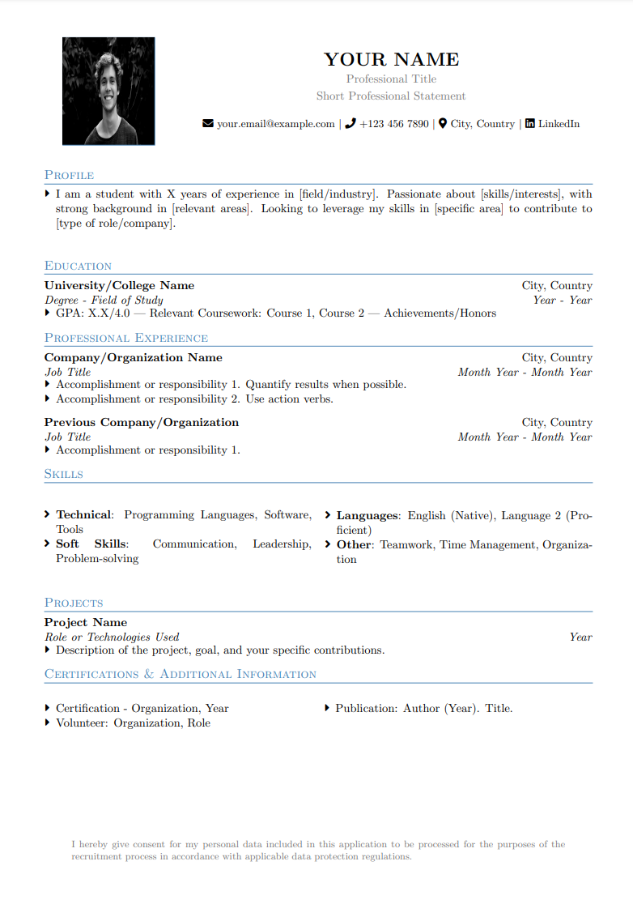

# Szablon CV w LaTeX

Czysty, profesjonalny i konfigurowalny szablon CV stworzony w LaTeX.



## Wersje językowe

- **Angielski**: Główna gałąź (main)
- **Polski**: Dostępna w gałęzi `cv-pl` (aktualna)

## Wymagania wstępne

- Dystrybucja LaTeX (np. TeX Live, MiKTeX)
- Edytor LaTeX (np. TeXstudio, Overleaf)

## Pierwsze kroki

1. Otwórz plik `cv.tex` w edytorze LaTeX
2. Zastąp dane przykładowe swoimi danymi osobowymi
3. Skompiluj dokument, aby wygenerować plik PDF

## Dostosowanie

### Schemat kolorów

Możesz zmienić kolor główny, modyfikując wartości RGB w:

```tex
\definecolor{primary}{RGB}{70, 130, 180} % Stalowy niebieski
```

### Sekcje

Dodawaj, usuwaj lub zmieniaj kolejność sekcji według potrzeb. Każda sekcja ma następujący wzór:

```tex
\section{Nazwa Sekcji}
\cvEntry{Tytuł}{Lokalizacja}{Podtytuł}{Zakres Dat}
\begin{itemize}[leftmargin=*]
  \cvSubItem{Opis punktu 1}
  \cvSubItem{Opis punktu 2}
\end{itemize}
```

### Zdjęcie

Szablon zawiera miejsce na zdjęcie w sekcji nagłówka, obok imienia i danych kontaktowych. Aby dostosować:

```tex
\begin{minipage}[c]{0.22\textwidth}
    \raggedleft
    \includegraphics[width=3cm,height=3.5cm,clip]{images/photo.jpg}
\end{minipage}
```

Po prostu zastąp `images/photo.jpg` ścieżką do swojego zdjęcia. Zdjęcie powinno być profesjonalne i mieć proporcje 3:3,5.

## Wskazówki do tworzenia świetnego CV

1. **Zachowaj zwięzłość**: Dąż do maksymalnie 1-2 stron
2. **Przedstawiaj osiągnięcia liczbowo**: Używaj liczb, aby pokazać swój wpływ
3. **Stosuj czasowniki dynamiczne**: Rozpoczynaj punkty od mocnych czasowników
4. **Dostosuj do każdej aplikacji**: Podkreślaj umiejętności/doświadczenia istotne dla danej oferty
5. **Sprawdzaj dokładnie**: Kontroluj błędy literowe i formatowanie

## Licencja

Ten szablon jest dostępny na licencji MIT. Zobacz plik [LICENSE](LICENSE) dla szczegółów.

Źródło zdjęcia: https://www.pexels.com/pl-pl/zdjecie/mezczyzna-na-portret-szarej-koszuli-91227/