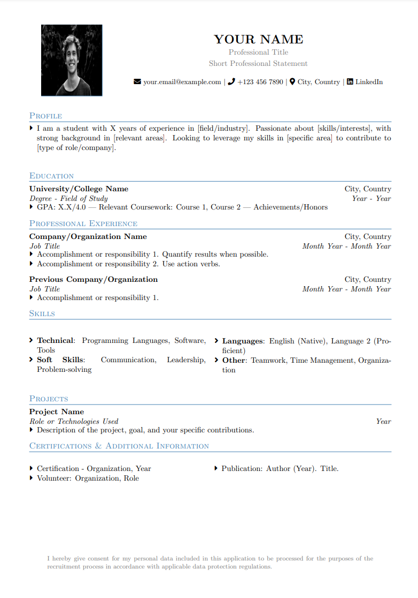

# LaTeX CV Builder

A desktop CV builder (Rust + egui) that edits your CV in a form and exports LaTeX, PDF, Markdown, HTML or plain text. The original LaTeX template (`cv.tex`) is still included.

## Features

- Live PDF preview: debounced background builds with cancel/progress, cached by source, and readable errors that point at the offending line (needs `tectonic`, `pdflatex` or `xelatex`, plus `pdftoppm` from poppler for the image preview)
- 7 templates (Classic, Modern Banner, Minimal, Executive, Compact, Academic, ATS-safe)
- Design settings: accent presets/colour, font, font size, margins, line spacing, section heading style
- Photo upload (PNG/JPEG) with shape (square, circle, rounded), size, zoom and crop offsets
- Custom sections and JSON Resume import/export
- Save/open `.cvproj` projects (versioned JSON schema)
- Undo/redo (Ctrl+Z / Ctrl+Y), Ctrl+S save, Ctrl+O open, Ctrl+E export PDF
- Unsaved-changes prompt, 30 s autosave with crash recovery
- Reorder, duplicate and delete entries and bullets
- Validation warnings (empty name, invalid email/link, CV too long)
- Bullets support `**bold**`, `*italic*` and `[text](url)`; all LaTeX special characters are escaped
- Export: `.tex`, PDF (needs `tectonic` or `pdflatex`), Markdown, HTML, ATS plain text

## Build

```sh
cargo run --release
cargo test
```

## Roadmap

Bundled Tectonic, LinkedIn/Markdown import, Polish UI/templates, installers.

---

# LaTeX CV Template

A clean, professional, and customizable CV/resume template created with LaTeX.



## Language Versions

- **English**: Main branch (current)
- **Polish**: Available in the `cv-pl` branch

## Prerequisites

- A LaTeX distribution (e.g., TeX Live, MiKTeX)
- A LaTeX editor (e.g., TeXstudio, Overleaf)

## Getting Started

1. Open `cv.tex` in your LaTeX editor
2. Replace the placeholder information with your personal details
3. Compile the document to generate a PDF

## Customization

### Color Scheme

You can change the primary color by modifying the RGB values in:

```tex
\definecolor{primary}{RGB}{70, 130, 180} % Steel Blue
```

### Sections

Add, remove, or rearrange sections as needed. Each section follows this pattern:

```tex
\section{Section Name}
\cvEntry{Title}{Location}{Subtitle}{Date Range}
\begin{itemize}[leftmargin=*]
  \cvSubItem{Description point 1}
  \cvSubItem{Description point 2}
\end{itemize}
```

### Photo

The template includes a photo placement in the header section, next to your name and contact information. To customize:

```tex
\begin{minipage}[c]{0.22\textwidth}
    \raggedleft
    \includegraphics[width=3cm,height=3.5cm,clip]{images/photo.jpg}
\end{minipage}
```

Simply replace `images/photo.jpg` with the path to your own photo. The photo should ideally be professional and have a 3:3.5 aspect ratio.

## Tips for Creating a Great CV

1. **Keep it concise**: Aim for 1-2 pages maximum
2. **Quantify achievements**: Use numbers to showcase your impact
3. **Use action verbs**: Begin bullet points with strong action verbs
4. **Customize for each application**: Highlight relevant skills/experiences
5. **Proofread carefully**: Check for typos and formatting issues

## License

This template is available under the MIT License. See the [LICENSE](LICENSE) file for details.

Photo source: https://www.pexels.com/pl-pl/zdjecie/mezczyzna-na-portret-szarej-koszuli-91227/
---

## Desktop App (Rust)

A native CV builder lives in `src/`: edit your CV in a GUI, pick one of 5 templates
(Classic, Modern Banner, Minimal, Executive, Compact), choose an accent colour, and
save/open projects locally as `.cvproj` (JSON) files (Ctrl+S saves).

```
cargo run --release        # run
cargo test                 # tests
```

- **Export .tex** writes standalone LaTeX (needs only standard packages).
- **Export PDF** uses `tectonic` or `pdflatex` if installed.
- GitHub Actions (`.github/workflows/build.yml`) builds `latex-cv.exe` (Windows), Linux and macOS binaries; tagging `v*` publishes a release.

The original `cv.tex` template remains usable on its own.
